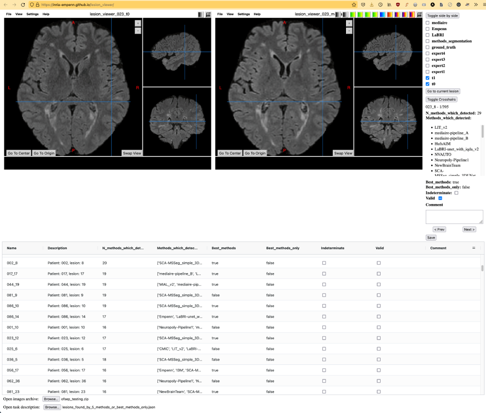

# Lesion Viewer

A nice tool to quickly view and annotate lesions from a large database.
It could be modified to also enable manual (and semi-automatic?) segmentation.

## Usage

### View or annotate lesions

For that you must have an image archive or folder, and a task description file. See the section below for more information on them.

- Go to https://inria-empenn.github.io/lesion_viewer/.
- Click "Open images archive" or "Open images" to open the images to view.
- Click "Open task description" to open the json file corresponding to the task you want to do.
- Annotate lesions. See the section below.
- Save the annotations with the "Save" button. This will save the task json file along with the annotations made by the user.

### User interfaces



The mouse enables to navigate in the image (click and drag on the different slices), as the arrow keys and the Page Up / Page Down keys.

To zoom in and out, click and drag up or down with the ALT key pressed.

The "Toggle side view" button enables to choose between a side-to-side view and a single view. The image checkboxes enable to show / hide each image.

The "Go to current lesion" button enables to return to the selected lesion (useful when we navigated far from it in the image).
The "Toggle Crosshairs" button (or `c` key) enables to show / hide the crosshairs (useful to see small lesions).

Below are a few fields:
 - the name of the lesion and its number (for example "1 over 395 lesions"),
 - the custom fields (as defined in the "fields" attribute of the task),
 - the "Valid" checkbox to define is the lesion is valid,
 - the "Comment" input to add a comment.

The "< Prev" and "Next >" buttons enable to navigate in the lesion list according (to the current table which might be filtered and or sorted).

Each modification is automatically saved in the local storage of the browser. Yet, no information is sent through the internet.

The "Save" button enables to save annotations in a json file which has the same format as the task file, but with the modifications in it.
Since the input and output json files have the same format, it is possible to load a json file which was saved by the lesion viewer. Doing this will load all annotations, and it will warn if the browser has some data recorded in the local storage for this task. 
The user has two options:
 - click "Cancel" to open the file as is (and discard the annotations in the local storage) 
 - or click "Ok" to load the annotations stored in the local storage.

The table lists all lesions. Clicking on a row loads the corresponding images and displays the lesion. It is possible to sort or filter the table.

There are a few useful keyboard shortcuts:
 - `*` to toggle the top image,
 - `-` to hide the top visible image,
 - `+` to show the image above the top visible image,
 - Keypad number to toggle the nth image,
 - `c` to toggle the crosshairs.

Papaya shortcuts (help menu > show keyboard reference):
```
[Spacebar] Cycle the main slice view in a clockwise rotation.
[Page Up] or ['] Increment the axial slice.
[Page Down] or [/] Decrement the axial slice.
[Arrow Up] and [Arrow Down] Increment/decrement the coronal slice.
[Arrow Right] and [Arrow Left] Increment/decrement the sagittal slice.
[g] and [v] Increment/decrement main slice.
[<] or [,] Decrement the series point.
[>] or [.] Increment the series point.
[o] Navigate viewer to the image origin.
[c] Navigate viewer to the center of the image.
[a] Toggle main crosshairs on/off.
```

### Create a task file to view a database

The `create_lesions_list.py` script in this repository is an example to create a json task file.

A task file has the following structure:

```
{
	"lesions": [
		{
			"name": "8099YL-GMMZZO-0417OF-RMMMVC_5", 										# The lesion name
			"location": [																	# The lesion location in physical space (optional, the location in voxel is used)
				14.5,
				-8.940818786621094,
				56.22611999511719
			],
			"location_voxel": [																# The lesion location in voxel
				158,
				106,
				91
			],
			"description": "Patient: 8099YL-GMMZZO-0417OF-RMMMVC, lesion: 5", 				# The lesion description
			"new": true,																	# The "new" custom field described in the fields below
			"growing": true,																# The "growing" custom field described in the fields below
			"images": [																		# The image list for this lesion
				{
					"name": "time01",														# The name of the image
					"file": "8099YL-GMMZZO-0417OF-RMMMVC_flair_time01.nii.gz",				# The path of the image in the image archive or folder
					"parameters": {															# The [Papaya images options](https://github.com/rii-mango/Papaya/wiki/Configuration#image-options))
						"minPercent": 0,													# Can be min or minPercent
						"maxPercent": 1,													# Can be max or maxPercent, a nice trick is to use different max values on the same look-up table to display different label images with different colors
						"lut": "Grayscale"
					},
					"display": true 														# Wether to display the image by default or not
				},
				{
					"name": "time02",
					"file": "8099YL-GMMZZO-0417OF-RMMMVC_flair_time02.nii.gz",
					"parameters": {
						"minPercent": 0,
						"maxPercent": 1,
						"lut": "Grayscale"
					},
					"display": true
				},
				[...]
			]
		},
		[...]
	],
	"fields": [																				# The list of the custom fields in the lesion table
		{
			"field": "new",																	# The field name
			"sortable": true,																# The column will be sortable
			"resizable": true,																# The column (width) will be resizable
			"filter": true,																	# Enable to filter the column
			"editable": true,																# Enable to edit values in the column
			"longiseg_type": "bool",														# Create a checkbox in the column for this boolean value
		},
		{
			"field": "growing",
			"sortable": true,
			"resizable": true,
			"filter": true,
			"editable": true,
			"longiseg_type": "bool",
		}
	]
}


```

The image archive or folder is just the place containing all images refered in the "images" attributes of the lesions of a task. In the example above, the images folder must at least contain the images `8099YL-GMMZZO-0417OF-RMMMVC_flair_time01.nii.gz` and `8099YL-GMMZZO-0417OF-RMMMVC_flair_time02.nii.gz`. It can also contains other files.

